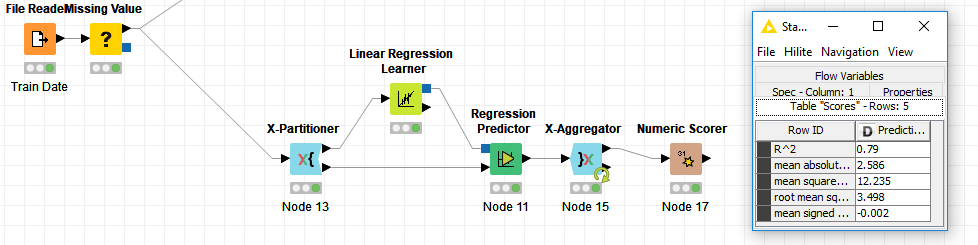
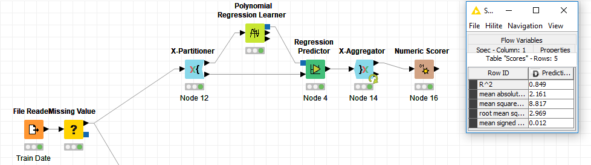

# Exercise #5 Auto MPG dataset and Regression Classifiers

In this exercise we were to use regression classifiers to try and predict the miles per gallon on a set of automobiles. The data that we were given was obtained from many different makes and models of automobiles from the 1970s and 1980s. The attributes included in the data sets were the number of cylinders, the displacement, the horsepower, the weight, the acceleration, the model year, the country of origin, and the car’s model name. On the training dataset the MPG for each automobile was also provided. The regression algorithms I chose to use are a linear regression and a polynomial regression. For both of my algorithms the K-fold cross-validation steps were pretty important in getting a more accurate R2value. With such a small set of data this step proved to help quite a bit. 

For the linear regression algorithm I started with only the attributes that I thought would make the most impact which was the weight, the horsepower, and the cylinders. This did yield an okay R2value of 0.64 and a mean squared error of 20.92 but this was strange to me because I thought these values would be the most significant in prediction. As I was playing around with the attributes on this algorithm I started to see a trend that I wasn’t expecting. The attributes that I thought would be the most influential turned out to be the opposite. The best combination of attributes proved to be the weight, the acceleration, the model year and the country of origin for this particular algorithm. I finally ended up with a pretty good R2value of 0.79 and a mean squared error value of 12.23. I also ran the K-fold cross-validation step 24 times. This proved to be the perfect spot and when I went higher or lower the prediction scores would get lower.

These results were not bad but I was hoping to do better with the Polynomial Regression algorithm. I also included the 24 step K-fold cross-validation into this algorithm for the same reasons as above and it did prove to help some. Because the attributes that I thought would do well in the linear regression algorithm ended up doing poorly, I decided to try them in the Polynomial Regression algorithm first. So I started with the cylinders, the displacement, the horsepower and the weight. This yielded a R2value of 0.71 and a mean squared error value of 16.43 this was okay but I immediately tried the same combination of attributes that I used on the Linear Regression. This did not result in much of a prediction improvement. After messing around with a couple different combinations of attributes I finally just added them all except the string value that was the car’s model name and the country of origin value. This finally led to the highest R2value yet of 0.849 and a mean squared error of 2.161. These were the best values I was able to get with all of the experimentation and K-fold cross-validation steps. Because of this outcome I will use the polynomial regression algorithm in Python.

### Python implementation

I implemented the Polynomial regression workflow in Python and the prediction results have been saved to the csv in this directory.
