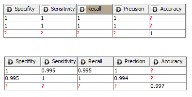
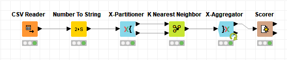
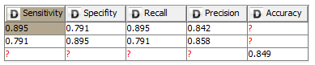
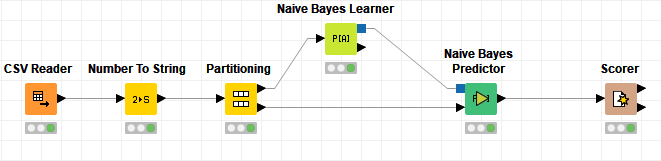

## Exercise #4 Bank Note Authentication
The parameters that I tried with the K Nearest Neighbor algorithm didn’t seem to make that much of a difference on this particular data set. Starting with three neighbors as the parameters for the algorithm yielded a perfect accuracy, precision, and recall of one. As I increased the number of neighbors seemed to actually hurt the models predictive capability. 

The figure below illustrates the accuracy statistics for a parameter of three neighbors and ten rounds of validations and then for a parameter of seven neighbors and ten rounds of validation.

As you can see as the number of neighbors increased the model was actually less accurate. This leads me to believe that this data set was very tightly clustered because once the algorithm had to start looking for more neighbors that were farther away the classification got worse. I did use K-fold cross validation in my experiments although adjusting the number of folds did nothing to increase of decrease the models predictive capability. Because the number of folds used didn’t effect the model at all I stuck with ten folds for most of my experiments. Overall this model was very capable of classifying this dataset. From the above figures you can see that is had perfect prediction score when the neighbors parameter was set to three. Below are the nodes I used for this exercise. 

For the Naive Bayes model the parameters were much more influential. I started by using the partitioner on Absolute so that there would be no partition at all and the model had a much more difficult time predicting. With one partition the accuracy was 86%, the precision was 79%, and the recall was 93%. When I increased the partitions to two the accuracy was 85%, the precision was 80%, and the recall was 87%. Essentially if I messed with any of the defaults the model got a little bit worse. This makes sense to me in that this dataset was pretty small and the learner was able to perform better when it had a larger amount of rows to operate on and learn from. The best accuracy statistics that I got were from using the complete defaults on the model and nodes. 

The figure below illustrates the accuracy statistics when there was a single partition in the data, and the default probability was set to 0. This was the best I got during my experiments.

The figure below shows the nodes I used for the Naive Bayes Classifier.

From these experiments I think that the optimum algorithm for this dataset is the K Nearest Neighbor algorithm with a neighbor parameter of three.
