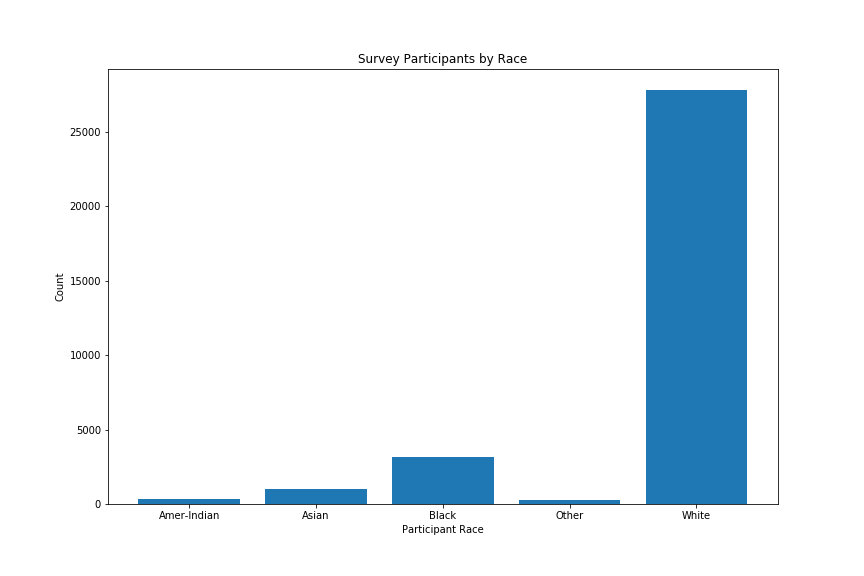
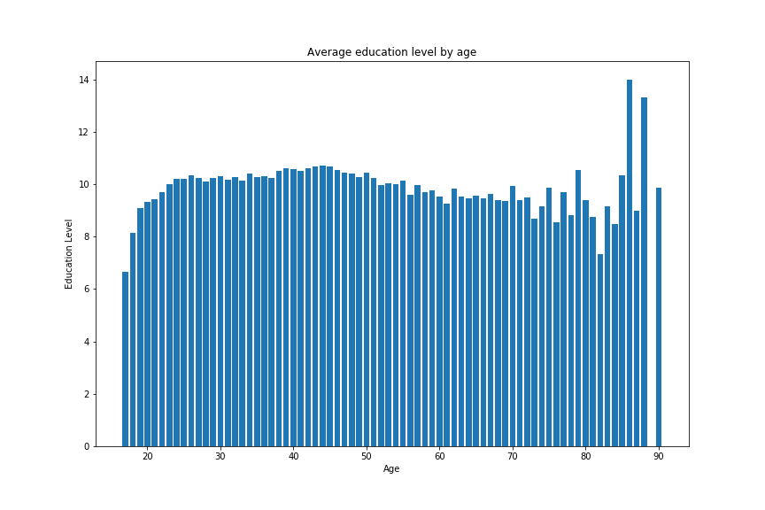
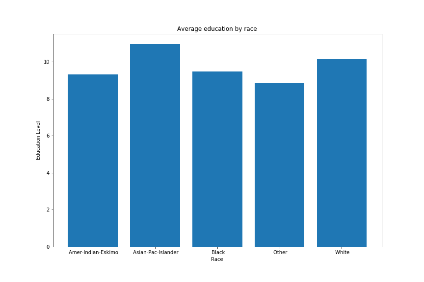

# Exercise #1 Data Visualization with Python
- What trends	did	you	look for?
- What trends	did you	find?
- How did	you	find them?

The first thing I wanted to know about the data is how _skewed_ it was. I wanted to know the total number of each ethnicity that took the survey so I could understand how _representative_ this census data was of the total population. I then wanted to know the average education level based on age groups. The data had a 'education-num' feature which quantified the education of each participant and I wanted to plot that against the different age groups. Lastly I wanted to know what the education levels looked like if the participants where grouped by race. 

It didn't take long to realize that this data was not very representative of the population at all. The first trend I found that the vast majority of participants were white, over seventy five percent in fact. This means that the remaining almost fifteen percent was represented by over four races. **Figure 1** shows the total number of participants by their race. This can help us to understand that this data is more representative of the white participants. The second trend I found is that the education levels by age tended to be lower of those participants who were born between 1910 - 1930. I grouped all participants by their age and then took the average of the education number. From the list below you can see that in **Figure 2** the average education level was at minimum a high school deploma. The trend in drop of education is evident towards the right side of the graph. Lastly, I plotted the average education level again but this time I instead grouped the participants by their race. The trend that I found was that on average minorities had less education but not by much. All races seemed to hover around a high school deploma for this data set with the 'Other', 'Black', and 'American-Indian-Eskimo' groups falling only slightly behind. **Figure 3** shows the average education level by race.

- 1: Preschool
- 2: 1st - 4th
- 3: 5th - 6th
- 4: 7th - 8th
- 5: 9th
- 6: 10th
- 7: 11th
- 8: 12th
- 9: Highschool Deploma
- 10: Some College
- 11: Associates-Vocational
- 12: Associates Degree
- 13: Bachelors
- 14: Masters
- 15: Professional School
- 16: Doctorate

### Figure 1

### Figure 2

### Figure 3

