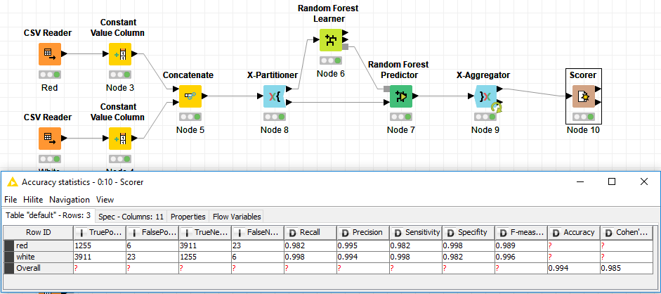
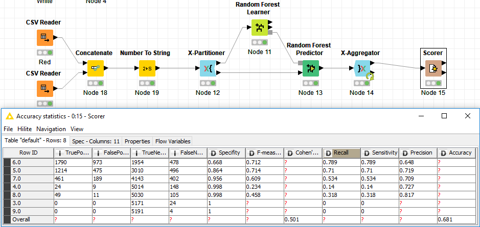
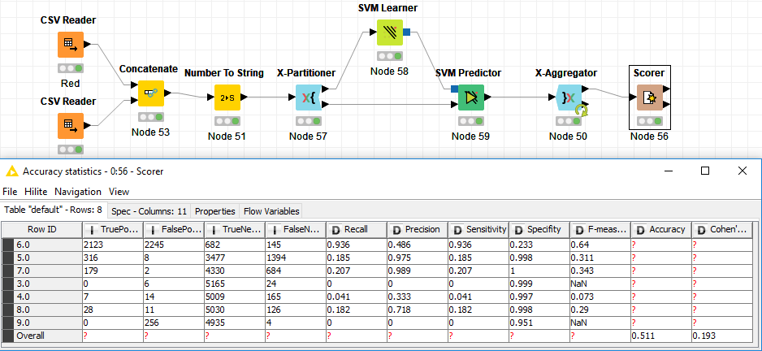

# Exercise #6 Predicting Wine Quality and Type

In this exercise the goal is to predict the type of wine, red or white, as well as the quality on a scale of zero to ten with ten as the best. We are given two sets of training data, one dataset for red wine and one dataset for white wine, each set consisting of numeric values for the attributes ‘fixed acidity’, ‘volatile acidity’, ‘citric acid’, ‘residual sugar’, ‘chlorides’, ‘free sulfur dioxide’, ‘total sulfur dioxide’, ‘density’, ‘pH’, ‘sulphates’, ‘alcohol’, and ‘quality’. Each of these attributes was computed based on physicochemical tests. We were allowed to use any algorithm we wanted with the goal of getting the most accurate results possible.

To start, I decided to work some decision tree algorithms solely for my own learning purposes even though after doing some research I found that a Support Vector Machine tends to perform better on this data. The first decision tree algorithm I tried was the random forest. While all three of the algorithms I tried did very well on the type classifications, the random forest algorithm did exceedingly well getting scores in the high nineties. I did try to switch up some of the parameters of this algorithm a bit but everything I tried made the score worse. In Knime the only real control over this algorithm you have is the attributes you feed to the learner and the number of partitions you use on the X-Partitioner. I tried removing some of the attributes so the learner didn’t have such high dimensionality to work with but still I get a less accurate prediction.

 The quality prediction proved to be much more difficult to improve. The only thing I needed to adjust in Knime for my workflow to predict the quality was to transform the class attribute from a string to a number so all red wines would be zero and white wines would be one. I also had to change which column the random forest learner was using to predict on. Once I made those small adjustments I was off and learning...only to find a prediction accuracy of sixty-eight percent. I was very surprised by this low accuracy outputs so I immediately tried some other algorithms.

The second algorithm I tried was the Decision Tree Learner algorithm in Knime with virtually the same setup as the random forest algorithm. When predicting the class this algorithm did really well also, with accuracy in the high nineties. On the quality prediction it did even worse than the random forest algorithm with fifty-five percent. This algorithm had a lot more parameters to tune but again adjusting the parameters made the accuracy worse. The only thing that helped was setting the Pruning Method to MDL.

Finally, I tried the Support Vector Machine algorithm. From what I had read online this algorithm does the best on this set of data. So I wired it up, in much the same way as the other two algorithms. Once I was getting predictions I was surprised at the accuracy again. The best I was able to get was 00 percent. I am not sure if I am doing something wrong or what the problem is but the best results that I found were coming from the random forest algorithm, across the board. There are a lot of settings on the support vector machine that I don’t know a whole lot about so perhaps the issue was with the way I had it configured. For the first time on my machine the computation involved in the support vector machine took some time. I would say it took approximately five minutes for the SVM learner to finish even when I lowered the C-aggregator partition size to five. Below are the results from my SVM workflow.

Again, overall the random forest algorithm performed the best on the classification of both the wine type as well as the wine’s quality so that is that algorithm I chose to use for my Python implementation.
